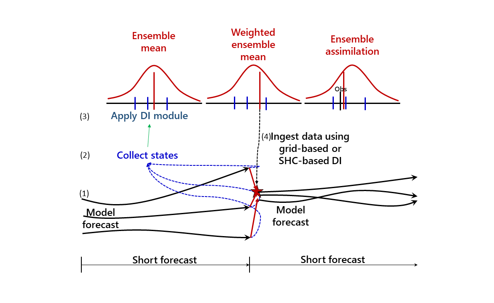
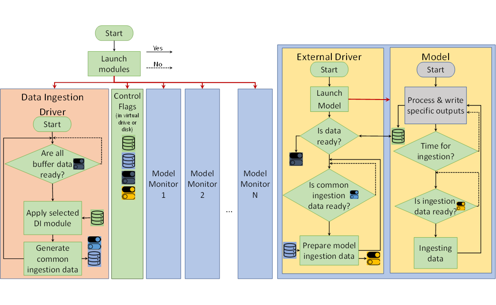

# Universal Synchronizer for Dynamic Models (USM)

<!--
 
-->

<!-- 

-->
A generic system which allows online data ingestion for any dynamic model.

## Concepts 

### Flowchart

## Module

* All modules are well-defined to achieve Plug and Play (PnP) in dynamic modelling. 

## Potential applications

* Interactive Ensemble

* Supermodeling 

* Dynamic ensemble assimilation 

* Dynamic down-scaling or up-scaling 

* Note: 
  - Please download released version instead of current 'master' branch. Current master branch is normally on the stage of working in progress and may not 100% bug free.
  - The key feature of this package is snapshot data ingestion which alows dynamic models generically exchanging state information.   

* This is a generic package to update states of general circulation models (GCMs) on the fly through each GCM's nudging module and a simple pause/resume approach. Potential applications includes but not limits to
  - Updating Model states with model data corrected by data assimilation scheme.
  - Interactively connecting multiple Models.

## Release Notes

* [Logs](/docs/Release_Logs.md) 

    The Universal Synchronizer Copyright (C) 2020 Mao-Lin Shen
    Contact info: earnestshen@gmail.com; maolin.shen@uib.no

